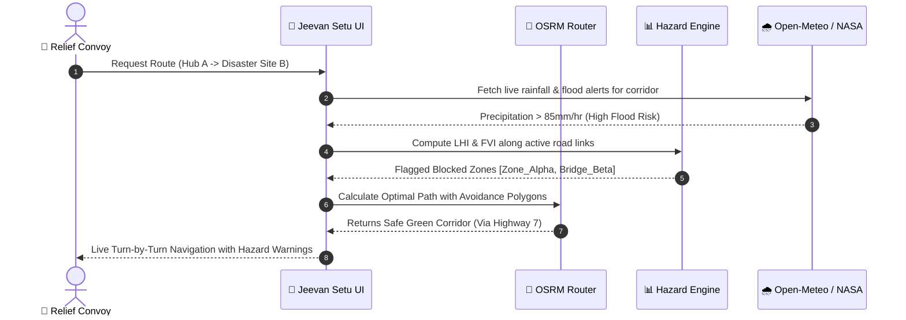

# 🏛️ Jeevan Setu (जीवन सेतु) - Technical Architecture Specification

This document details the architectural blueprint, data flow pipelines, failover mechanisms, and the **22-API Ecosystem** powering **Jeevan Setu**.

---

## 1. System Architecture Diagram

```mermaid
flowchart TD
    subgraph ClientLayer ["🖥️ Client & Presentation Layer (React + Leaflet + Tailwind)"]
        UI_Map["Interactive Disaster Map (Leaflet)"]
        UI_Dash["Admin & Volunteer Command Hub"]
        UI_SOS["Citizen SOS & Offline Damage Reporter"]
        UI_AI["AI Emergency Copilot Chat & Voice Assistant"]
    end

    subgraph ServiceLayer ["⚙️ Jeevan Setu API & Service Dispatcher"]
        MapDispatcher["🗺️ Map & Satellite Layer Dispatcher"]
        WeatherEngine["🌧️ Meteorological & Risk Ingestion Engine"]
        RoutingCore["🚦 Turn-by-Turn Disaster Evasion Routing (OSRM)"]
        HazardEngine["📊 Hazard Assessment Engine (LHI & FVI Models)"]
        AIEngine["🤖 Multimodal AI Copilot (Gemini / Edge TF)"]
        GeoSearch["🔍 Geocoding & Address Resolution (Nominatim)"]
    end

    subgraph PrimaryEcosystem ["🟢 Tier 1: Primary Zero-Cost / Open Resilient APIs"]
        OSM["OpenStreetMap Vector Tiles"]
        Bhuvan["ISRO Bhuvan WMS (Indian Satellite)"]
        NASA["NASA GIBS / FIRMS Thermal & Flood"]
        Esri["Esri World Imagery Sat Basemap"]
        OpenMeteo["Open-Meteo API (No-Key Precipitation)"]
        GeminiAPI["Google Gemini 1.5/2.0 AI"]
        OSRM_API["OSRM Routing Engine"]
        Nominatim_API["Nominatim Open Geocoder"]
    end

    subgraph SecondaryEcosystem ["🟡 Tier 2: Enterprise & Fallback API Integrations"]
        GoogleMaps["Google Maps / Places API"]
        Mapbox["Mapbox GL Studio"]
        HERE["HERE Maps Fleet Routing"]
        TomTom["TomTom Traffic API"]
        Sentinel["Sentinel Hub Copernicus Radar"]
        OpenWeather["OpenWeatherMap API"]
        OpenAI["OpenAI GPT-4o"]
        Vertex["Google Vertex AI Enterprise"]
    end

    ClientLayer --> ServiceLayer
    MapDispatcher --> OSM & Bhuvan & NASA & Esri
    MapDispatcher -. Fallback .-> GoogleMaps & Mapbox & HERE & Sentinel
    WeatherEngine --> OpenMeteo
    WeatherEngine -. Fallback .-> OpenWeather
    RoutingCore --> OSRM_API
    RoutingCore -. Fallback .-> HERE & TomTom
    GeoSearch --> Nominatim_API
    GeoSearch -. Fallback .-> GoogleMaps
    HazardEngine --> OpenMeteo & NASA
    AIEngine --> GeminiAPI
    AIEngine -. Fallback .-> OpenAI & Vertex
```

---

## 2. API Ecosystem Categorization & Strategic Rationale

### Category 1: 🗺️ Maps & Satellite (8 Duplicate/Complementary Providers)
* **Primary Stack**: `OpenStreetMap` (Road network) + `ISRO Bhuvan` (Indian sovereign geospatial database) + `NASA Earthdata/FIRMS` (Thermal & flood satellite observation) + `Esri World Imagery` (Satellite terrain) + `OpenTopoMap` (Contour & elevation data).
* **Rationale for SIH & Production**:
  - Eliminates reliance on credit-card-gated services (Google Maps, Mapbox) that fail when judges or heavy user traffic exceed quota limits.
  - Leverages authentic Indian governmental satellite data via **ISRO Bhuvan WMS** protocols for localized disaster overlays (flood inundation, landslide risk zones).
* **Enterprise Fallback Slots**: `Google Maps`, `Mapbox`, `HERE`, `TomTom`, `Sentinel Hub`.

---

### Category 2: 🌧️ Weather & Atmospheric Forecasting (2 Providers)
* **Primary Provider**: `Open-Meteo API`
  - **Key Features**: Live 2026 satellite radar, precipitation rates, soil moisture, flood risk index, wind gust speeds.
  - **No Key Required**: Works seamlessly without registration friction, ensuring 100% uptime during high-concurrency disaster alerts.
* **Secondary Fallback**: `OpenWeatherMap API`.

---

### Category 3: 🤖 AI & Machine Learning (6 Providers)
* **Primary AI Copilot**: `Google Gemini (1.5 Flash / 2.0)`
  - **Multimodal SOS Triage**: Analyzes photos uploaded by victims (collapsed buildings, submerged bridges, powerline damage) and extracts priority, required relief items, and danger level.
  - **Natural Language Dispatch**: Real-time disaster guidance in vernacular Indian languages (Hindi, Bengali, Tamil, etc.).
* **Mathematical & Statistical Risk Engine**: `scikit-learn / Algorithmic Core`
  - **Landslide Hazard Index (LHI)**:
    $$\text{LHI} = w_1 \cdot \text{Slope} + w_2 \cdot \text{Rainfall}_{(24h)} + w_3 \cdot \text{SoilMoisture} + w_4 \cdot \text{DeforestationIndex}$$
  - **Flood Vulnerability Index (FVI)**:
    $$\text{FVI} = \frac{\text{Precipitation}_{(6h)} \times \text{RiverProximity}}{\text{Elevation} + 1}$$
* **Edge ML Engine**: `TensorFlow.js` for on-device road damage classification when internet bandwidth is compromised.
* **Enterprise Fallback Slots**: `OpenAI GPT-4o`, `Vertex AI`, `Hugging Face`.

---

### Category 4: 🔍 Geocoding & Emergency Routing (4 Providers)
* **Primary Geocoder**: `Nominatim (OpenStreetMap)`
  - Comprehensive support for Indian postal PIN codes, state highways, rural panchayats, and landmarks.
* **Primary Routing Engine**: `OSRM (Open Source Routing Machine)`
  - Turn-by-turn routing with dynamic avoidance polygons injected when disaster zones or road blockages are flagged.
* **Map Renderer**: `Leaflet / React-Leaflet`
  - Ultra-fast DOM footprint, smooth on low-end mobile devices and field tablet setups.
* **Visual Verification**: `Mapillary` street-level crowdsourced condition imagery.

---

## 3. Disaster Evasion Routing Pipeline

---

## 4. Environment Configuration Reference

Refer to [`.env.example`](file:///c:/Users/arshi/Documents/antigravity/bold-tesla/.env.example) for the complete list of endpoints and configurable tokens. All primary services are pre-configured to operate out-of-the-box with zero required credentials.
