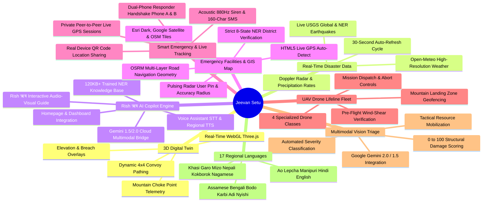
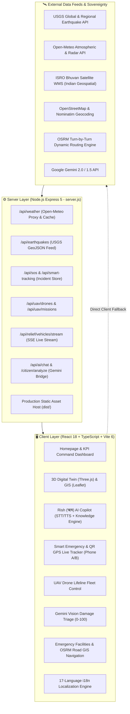

<div align="center">

# 🌉 Jeevan Setu (जीवन सेतु)
### AI-Powered Disaster Logistics, 3D Digital Twin, Real-Time Emergency Response & Resilient Supply Bridge
**Ministry of Development of North Eastern Region (MoDoNER) & North Eastern Council (NEC)**  
*Smart India Hackathon (SIH) • Problem Statement ID: 26002*

<br/>

[](https://github.com/pragyakatiyar73-cyber/Jeevan-setu)
[](https://github.com/pragyakatiyar73-cyber/Jeevan-setu)
[](https://github.com/pragyakatiyar73-cyber/Jeevan-setu)
[](https://github.com/pragyakatiyar73-cyber/Jeevan-setu)
[](https://github.com/pragyakatiyar73-cyber/Jeevan-setu)
[](https://github.com/pragyakatiyar73-cyber/Jeevan-setu)
[](https://github.com/pragyakatiyar73-cyber/Jeevan-setu)
[](https://github.com/pragyakatiyar73-cyber/Jeevan-setu)
[](https://github.com/pragyakatiyar73-cyber/Jeevan-setu)
[](https://github.com/pragyakatiyar73-cyber/Jeevan-setu)

<br/>

<p align="center">
  <a href="#-executive-summary">Executive Summary</a> •
  <a href="#-key-capabilities--modules">Key Capabilities</a> •
  <a href="#-100-genuine-real-time-disaster-intelligence">Real-Time Intelligence</a> •
  <a href="#-dual-ai-disaster-copilot--rish-ऋष-guide">AI Copilot & Rish</a> •
  <a href="#-emergency-facilities--osrm-gis-road-navigation">Emergency Facilities & OSRM</a> •
  <a href="#-private-smart-emergency--qr-mobile-live-tracking">Smart SOS & QR Tracking</a> •
  <a href="#-3d-digital-twin--mountain-corridor-simulation">3D Digital Twin</a> •
  <a href="#-uav-drone-lifeline-delivery-fleet">UAV Drone Fleet</a> •
  <a href="#-multimodal-gemini-vision-damage-triage">Vision Damage Triage</a> •
  <a href="#-mathematical-models">Mathematical Models</a> •
  <a href="#-fullstack-system-architecture">System Architecture</a> •
  <a href="#-integrated-data--rest-api-ecosystem">Data & REST APIs</a> •
  <a href="#-17-regional-north-eastern-languages--dialects">Languages</a> •
  <a href="#-quick-start--local-setup">Quick Start</a> •
  <a href="#-verified-project-directory-layout">Directory Layout</a>
</p>

---

</div>

## 📌 Executive Summary

During annual monsoon surges and cloudbursts across the **8 North Eastern States of India** (*Assam, Meghalaya, Arunachal Pradesh, Sikkim, Nagaland, Manipur, Mizoram, Tripura*), catastrophic landslides and flash floods regularly sever arterial highways like **NH-6, NH-10, NH-13, NH-27, NH-29, NH-37, and NH-306**. Critical lifelines—high-altitude medical oxygen, blood plasma, emergency ration packs, and fuel reserves—are frequently stranded for days.

Standard civilian navigation tools (such as Google Maps) fail in mountain disaster zones because they optimize for passenger car velocity and are blind to geotechnical slope saturation, river flood discharge velocities, bridge tonnage thresholds, and medical triage priority.

**Jeevan Setu (जीवन सेतु)** is an operational, mission-critical AI disaster logistics, 3D simulation, GIS road navigation, and real-time emergency response platform built specifically for the **Ministry of Development of North Eastern Region (MoDoNER)**, the **North Eastern Council (NEC)**, and the **National Disaster Response Force (NDRF)**.

---

## 🌟 Key Capabilities & Modules



---

## 🌋 100% Genuine Real-Time Disaster Intelligence

Unlike static mockups, Jeevan Setu ingests, correlates, and displays **live sensor and meteorological feeds**:

* **Live USGS Seismic Feed**: Ingests active seismic events directly from the official USGS API (`earthquake.usgs.gov`), computing real-time magnitude, focal depth, exact timestamp, epicenter coordinates, and distance from North Eastern regional capitals.
* **Open-Meteo High-Resolution Weather & Radar Grid**: Real-time hourly precipitation rates (mm/h), wind gust velocities, temperature, humidity, and cloudburst hazard indicators across all 8 NER state capitals and critical mountain highway sectors.
* **Auto-Refreshing Monitoring Engine**: In-memory and UI-level 30-second synchronization ticker with countdown badge, active alert counters, and manual instant refresh controls.
* **Universal Flashing Red Emergency Alert Banner**: High-visibility notification banner alerting users to active regional disaster states with 1-click dismissal and direct helpline access.

---

## 🤖 Dual AI Disaster Copilot & Rish (ऋष) Knowledge Engine

The **Jeevan AI Agent & Rish (ऋष) Guide** is powered by a hybrid architecture combining an on-device offline-first Knowledge Engine with a cloud multimodal LLM bridge, seamlessly integrated into:
1. **Public Portal Homepage** (`src/components/JeevanSetuHomepage.tsx`)
2. **Operations Command Dashboard** (`src/components/AIChatbotWidget.tsx`)

```
                        ┌────────────────────────────────────────┐
                        │      Citizen / Field Responder         │
                        │ (Voice Input or Text in 17 Dialects)   │
                        └──────────────────┬─────────────────────┘
                                           │
                                           ▼
                        ┌────────────────────────────────────────┐
                        │       AI Knowledge Matcher             │
                        │    (Regex Tokenizer & Levenshtein)     │
                        └──────┬──────────────────────────┬──────┘
                               │                          │
               Direct Domain Hit│                          │ Complex / Fallback
                               ▼                          ▼
                ┌───────────────────────────────┐ ┌───────────────────────────┐
                │  Hardened NER Knowledge Base  │ │  Google Gemini 2.0 / 1.5  │
                │  - Real-time Highway Passes   │ │  REST Fallback Pipeline   │
                │  - Weather across 8 Capitals  │ │  (Contextual Assessment)  │
                │  - Stockpiles & Drone Classes │ └─────────────┬─────────────┘
                │  - 24x7 State SOS Helplines   │               │
                └───────────────┬───────────────┘               │
                                │                               │
                                └───────────────┬───────────────┘
                                                │
                                                ▼
                        ┌────────────────────────────────────────┐
                        │   Bilingual Audio Speech Synthesis     │
                        │  (TTS in Hindi, Assamese, Bengali...)  │
                        └────────────────────────────────────────┘
```

* **Comprehensive NER Knowledge Base (`src/services/ai/aiKnowledgeEngine.ts`)**: Built-in, zero-latency domain intelligence containing verified emergency control room numbers, arterial highway chokepoints (NH-6, NH-10, NH-13, NH-27, NH-29, NH-37, NH-306), alternate bypass corridors, district hospital coordinates, blood bank reserves, and NDMA protocols across all 8 NER states.
* **Rish (ऋष) Interactive Audio-Visual Walkthrough (`CitizenVideoWalkthroughModal.tsx`)**: Built-in interactive audio guide branded as **Rish / ऋष** that walks citizens step-by-step through SOS triggers, offline features, 3D corridor maps, and live emergency tracking with auto-advancing audio narration.
* **Hands-Free Web Speech Integration**:
  - **Speech-to-Text (STT)**: Speak directly into the microphone for hands-free queries during field operations.
  - **Text-to-Speech (TTS)**: Vocal audio playback of response steps in the user's selected regional dialect.

---

## 🏥 Emergency Facilities & OSRM GIS Road Navigation

The **Emergency Facilities & Rescue Points Intelligence Module** (`src/components/EmergencyFacilitiesModule.tsx` & `src/services/api/emergencyFacilitiesService.ts`) provides a comprehensive GIS mapping grid across the 8 NER states:

* **📡 HTML5 Live GPS Auto-Detect**: Detects the user's live device coordinates in real time via browser Geolocation (`handleDetectLiveGPS`). Renders an animated pulsing radar marker (`userPulse`) with an interactive accuracy radius circle.
* **🛣️ Real OSRM Road Navigation Polyline**: Replaces static straight lines with **real-time multi-layer road navigation geometry** fetched from the OpenStreetMap OSRM routing engine. Features a 3-tier visual polyline (Cyan Outer Glow + Sky Blue Core + Animated White Pulse Dash) that strictly follows actual highways, streets, and mountain passes.
* **📍 Strict 8-State NER District Validation**: Includes automated reverse state-district verification (`getCorrectStateForDistrict`). Ensures that every district (e.g., *Tseminyu*) is accurately assigned to its correct parent state (*Nagaland*), preventing cross-border data mismatches.
* **🗺️ Multi-Layer GIS Basemap Switcher**: Supports instant toggling between **Esri Dark Gray Canvas**, **Google High-Res Satellite Images**, and **OpenStreetMap Street** tiles with smooth container resize handling.
* **📞 Safe Telephone Badging**: Automatically renders discrete grey non-clickable badges (`No Direct Phone`) for facilities without active telephone numbers, eliminating misleading phone call buttons.

---

## 📱 Private Smart Emergency & QR Mobile Live Tracking

Built for extreme field conditions, the **Private Smart Emergency Response System** (`src/components/PrivateSmartEmergencyModule.tsx` & `src/components/MobileLiveLocationShareView.tsx`) provides secure peer-to-peer coordination between distress victims and responding convoys:

* **Private Peer-to-Peer Live Tracking Sessions**: Generates unique Incident Tracking IDs (`JS-TRK-...`) with an encrypted tracking link and live QR code (`/api/smart-tracking/create-qr-session`).
* **Dual Responder Coordination (Phone A & Phone B)**:
  - **Citizen / Victim View (Phone A)**: Displays live GPS fix, battery status, emergency contact broadcast, and responder arrival countdown.
  - **Responder / Fleet View (Phone B)**: Live tactical map showing responder unit location, live distance in kilometers, estimated time of arrival (ETA), and turn-by-turn navigation link to victim.
* **Real Device QR Code Share**: Enables authentic multi-person live tracking by allowing responders or family members to scan the generated QR code on their own mobile devices.
* **Acoustic 880Hz Dual-Warble Siren**: Browser-native Web Audio API synthesizer emitting a high-penetration 880Hz acoustic warble to guide physical search-and-rescue teams in heavy fog, debris, or zero-visibility mountain rain.
* **160-Character Compressed SMS Payload**: When cellular data collapses, compiles a compressed 160-character plain text SMS containing exact latitude, longitude, victim count, blood requirements, and incident classification pre-addressed to NDRF (1078) and SDRF dispatch.

---

## 🎮 3D Digital Twin & Mountain Corridor Simulation

Jeevan Setu incorporates an interactive **Three.js WebGL 3D Digital Twin** specifically calibrated for high-altitude choke points across North East India:

| Corridor | Highway | Disruption / Hazard | AI Green Corridor Bypass | Typical Time Saved |
| :--- | :--- | :--- | :--- | :--- |
| **Tawang Sector** | `NH-13` | 🔴 Sela Pass (3,500m MSL) Snow Slurry & Rockfall | 🟢 Kalaktang All-Weather Ridge Bypass | **-3.8 hours** |
| **Aizawl Link** | `NH-6` | 🔴 Km 142 East Khasi Hills Landslide (400m breach) | 🟢 Sector 9 Jowai - NH-27 Artery | **-4.2 hours** |
| **Gangtok Pass** | `NH-10` | 🔴 Melli Teesta River Basin Embankment Overwash | 🟢 Lava - Algarah - Reshi Ridge Corridor | **-5.1 hours** |
| **Kohima Highway** | `NH-29` | 🟡 Zubza Slopes Sub-Surface Subsidence | 🟢 Pfutsero Highland Link (Full 45 km/h) | **-2.4 hours** |
| **Imphal Valley** | `NH-37` | 🟢 Jiribam - Imphal Highway Link (Nominal) | 🟢 Standard Green Artery Confirmed | **On Schedule** |

---

## 🚁 UAV Drone Lifeline Delivery Fleet

The integrated **UAV Drone Module** (`src/components/UAVDroneModule.tsx`) coordinates last-mile delivery to cut-off mountain communities:

| Drone Class | Model Spec | Payload Capacity | Range | Primary Mission |
| :--- | :--- | :--- | :--- | :--- |
| **Octocopter Heavy Lifter** | 8-Rotor Carbon Hex | 25 kg | 45 km | Type-D O2 Cylinders, Blood Plasma Units |
| **High-Altitude Hybrid VTOL** | Fixed-Wing VTOL | 12 kg | 110 km | Sela Pass / High-Altitude First Aid |
| **Rapid Quad Lifesaver** | High-Speed Quad | 5 kg | 20 km | Antivenom, Water Purification Tabs |
| **Thermal Recon Scout** | Hexacopter with FLIR | 3 kg | 35 km | Night Survivor Detection, Slope Breach Scan |

---

## 📸 Multimodal Gemini Vision Damage Triage

The **AI Disaster Impact Assessment Module** (`src/components/AIDisasterImpactAssessment.tsx`) enables field responders and citizens to upload damage photographs for instant analysis:

* **0 to 100 Structural Damage Scoring**: Generates an algorithmic structural integrity assessment evaluating crack depth, foundation shift, and floodwater submersion.
* **Hazard Severity Classification**: Categorizes incidents from *Minor Debris* to *Catastrophic Structural Failure*.
* **Automated Tactical Dispatch Recommendation**: Instantly prescribes required assets (e.g., BRO JCB Excavators, NDRF Inflatable Boats, High-Capacity Water Pumps, Medical Evacuation Ambulances).

---

## 📐 Mathematical Models

### 1. Landslide Hazard Index (LHI)
$$\text{LHI} = \left(0.35 \times S_{\text{topo}}\right) + \left(0.25 \times R_{72\text{h}}\right) + \left(0.20 \times M_{\text{soil}}\right) + \left(0.20 \times F_{\text{seismic}}\right)$$

### 2. Multi-Criteria Disaster Routing Cost Function
$$C(e) = \text{Distance}(e) \times \left[ 1 + \alpha \cdot \text{LHI}(e) + \beta \cdot \text{FVI}(e) + \gamma \cdot \left(1 - \frac{T_{\text{bridge}}}{T_{\text{convoy}}}\right) \right]$$

---

## 🏗️ Fullstack System Architecture



---

## 🗣️ 17 Regional North Eastern Languages & Dialects

To serve grassroots communities and tribal sectors across all 8 North Eastern states, Jeevan Setu provides an integrated multi-language engine (`src/i18n/LanguageContext.tsx` and `src/i18n/locales/`):

1. **Assamese (অসমীয়া)** - `as.json`
2. **Bengali (বাংলা)** - `bn.json`
3. **Bodo (बड़ो)** - `brx.json`
4. **Karbi** - `kar.json`
5. **Adi** - `adi.json`
6. **Nyishi** - `nyi.json`
7. **Khasi (Ka Ktien)** - `kha.json`
8. **Garo (A·chik)** - `grt.json`
9. **Mizo (Mizo ṭawng)** - `mzo.json`
10. **Nepali (नेपाली)** - `ne.json`
11. **Kokborok / Tripuri** - `trp.json`
12. **Nagamese (নাগামিজ)** - `nag.json`
13. **Ao Naga** - `ao.json`
14. **Lepcha** - `lep.json`
15. **Meitei / Manipuri (মৈতৈলোন্)** - `mni.json`
16. **Hindi (हिन्दी)** - `hi.json`
17. **English** - `en.json`

---

## 🚀 Quick Start & Local Setup

### Prerequisites
* **Node.js**: `v18.0.0` or higher
* **npm**: `v9.0.0` or higher
* **Git**

### Installation & Local Run

```bash
# 1. Clone the repository
git clone https://github.com/pragyakatiyar73-cyber/Jeevan-setu.git
cd Jeevan-setu

# 2. Install dependencies
npm install

# 3. Launch Development Server (Frontend)
npm run dev
# Frontend will be live at: http://localhost:3000

# 4. Launch Backend API Server (in a separate terminal)
npm run server
# Backend will be live at: http://localhost:5001
```

### Building for Production

```bash
# Compile TypeScript and bundle with Vite
npm run build

# Preview production build locally
npm run preview
```

---

## 📂 Verified Project Directory Layout

```
Jeevan-setu/
├── ARCHITECTURE.md                  # Comprehensive Technical Blueprint & Mathematical Models
├── CONTRIBUTING.md                  # Contribution Guidelines
├── LICENSE                          # MIT Open Source License
├── README.md                        # Project Documentation & Pitch Guide
├── SECURITY.md                      # Security & Vulnerability Policy
├── index.html                       # Vite HTML5 Entrypoint
├── manifest.json                    # Progressive Web App (PWA) Manifest
├── netlify.toml                     # Netlify SPA Build & Redirect Rules
├── package.json                     # Dependencies & Build Scripts
├── render.yaml                      # Render Fullstack Deployment Blueprint
├── server.js                        # Express 5 API Server & Production Static Host
├── sw.js                            # Offline-First Service Worker Cache
├── tailwind.config.js               # Tailwind Design Tokens & Choke Point Styling
├── tsconfig.json                    # TypeScript Configuration
├── vite.config.ts                   # Vite 6 Bundler Configuration
├── public/                          # Static Assets, jeevan-setu-logo.jpg, Icons & _redirects
└── src/
    ├── main.tsx                     # React 18 Root Entrypoint
    ├── App.tsx                      # Primary View Router & State Orchestrator
    ├── index.css                    # Tailwind Directives & Custom Map Styling
    ├── components/                  # Enterprise React UI Modules
    │   ├── JeevanSetuHomepage.tsx   # Public Portal with Integrated Rish AI Guide
    │   ├── AIChatbotWidget.tsx      # Rish (ऋष) Copilot Voice & Text Widget
    │   ├── EmergencyFacilitiesModule.tsx   # OSRM GIS Road Navigation & Live GPS
    │   ├── PrivateSmartEmergencyModule.tsx # Real QR Mobile Session Tracking
    │   ├── MobileLiveLocationShareView.tsx # Mobile Tracker Responder View
    │   ├── UAVDroneModule.tsx       # 4-Class UAV Drone Command & Control
    │   ├── AIDisasterImpactAssessment.tsx  # Gemini Vision Damage Triage (0-100)
    │   ├── CitizenVideoWalkthroughModal.tsx# Rish (ऋष) Audio-Visual Walkthrough Guide
    │   ├── NERLiveMapModule.tsx     # 3D Digital Twin & Leaflet GIS Engine
    │   ├── DisasterReportsModule.tsx# Live Disaster Reports & Intelligence
    │   ├── RoadAccessibilityModule.tsx     # Highway Status & OSRM Green Routing
    │   ├── ReliefSupplyTrackingModule.tsx  # Stockpile Inventory & Convoy Logistics
    │   ├── WeatherIntelligence.tsx  # Doppler Radar & River Discharge Sensors
    │   ├── EmergencySOSModal.tsx    # SOS Dispatch & 880Hz Acoustic Siren
    │   ├── MDoNERCommandModule.tsx  # Executive Governance & Budget Tracking
    │   ├── AISituationReportModule.tsx     # Automated Situation Reports
    │   ├── LanguageSelector.tsx     # 17-Language Localization Switcher
    │   └── common/                  # Reusable UI Controls, Modals & Banners
    ├── i18n/                        # 17 Regional Languages & Dialects
    │   ├── LanguageContext.tsx      # React Language Provider & Dialect Hook
    │   └── locales/                 # JSON Dictionaries (as, bn, brx, kar, adi, nyi, kha, grt, mzo, ne, trp, nag, ao, lep, mni, hi, en)
    └── services/                    # Modular Services & API Clients
        ├── ai/
        │   └── aiKnowledgeEngine.ts # 120KB+ Trained NER Disaster Knowledge Base
        └── api/
            ├── apiConfig.ts         # Environment & Endpoint Resolver
            ├── earthquakeService.ts # Live USGS Seismic Ingestion
            ├── weather.ts           # Open-Meteo Precipitation & Radar
            ├── disasterReportsService.ts # Real-Time Reports Aggregator
            ├── smartTrackingService.ts   # Live GPS QR Session Management
            ├── emergencyFacilitiesService.ts # Emergency Hospital & Camp Data (8-State NER)
            ├── roadAccessibilityService.ts # Mountain Highway Corridors
            ├── routing.ts           # OSRM Turn-by-Turn Navigation Engine
            ├── hazardModels.ts      # LHI & FVI Geotechnical Scorer
            └── ai.ts                # Gemini API Bridge
```

---

<div align="center">
  <b>🌉 Jeevan Setu • Connecting Routes, Delivering Lifelines across North East India</b>
</div>