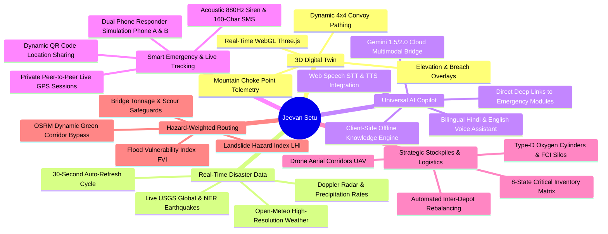
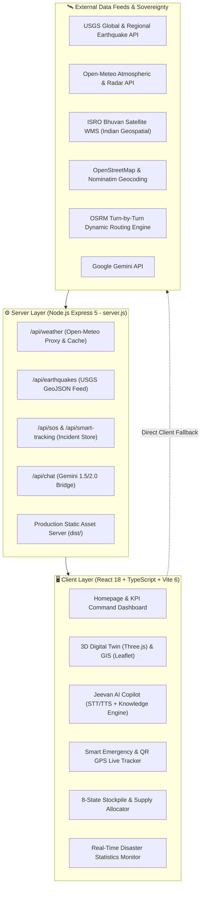

<div align="center">

# 🌉 Jeevan Setu (जीवन सेतु)
### AI-Powered Disaster Logistics, 3D Digital Twin, Real-Time Emergency Response & Resilient Supply Bridge
**Ministry of Development of North Eastern Region (MoDoNER) & North Eastern Council (NEC)**  
*Smart India Hackathon (SIH) • Problem Statement ID: 26002*

<br/>

[](https://github.com/pragyakatiyar73-cyber/Jeevan-setu)
[](https://github.com/pragyakatiyar73-cyber/Jeevan-setu)
[](https://github.com/pragyakatiyar73-cyber/Jeevan-setu)
[](https://github.com/pragyakatiyar73-cyber/Jeevan-setu)
[](https://github.com/pragyakatiyar73-cyber/Jeevan-setu)
[](https://github.com/pragyakatiyar73-cyber/Jeevan-setu)
[](https://github.com/pragyakatiyar73-cyber/Jeevan-setu)
[](https://github.com/pragyakatiyar73-cyber/Jeevan-setu)
[](https://github.com/pragyakatiyar73-cyber/Jeevan-setu)
[](LICENSE)

<br/>

<p align="center">
  <a href="#-executive-summary">Executive Summary</a> •
  <a href="#-key-capabilities--modules">Key Capabilities</a> •
  <a href="#-100-genuine-real-time-disaster-intelligence">Real-Time Intelligence</a> •
  <a href="#-universal-ai-copilot--knowledge-engine">AI Copilot</a> •
  <a href="#-smart-emergency-response--peer-to-peer-live-gps-tracking">Smart SOS & Tracking</a> •
  <a href="#-3d-digital-twin--mountain-corridor-simulation">3D Digital Twin</a> •
  <a href="#-mathematical-models">Mathematical Models</a> •
  <a href="#-fullstack-system-architecture">System Architecture</a> •
  <a href="#-integrated-data--api-ecosystem">Data & APIs</a> •
  <a href="#-16-regional--vernacular-languages">Languages</a> •
  <a href="#-quick-start">Quick Start</a> •
  <a href="#-cloud-deployment-guide">Deployment Guide</a> •
  <a href="#-pitch-guide-for-judges--evaluators">Judge Pitch Guide</a>
</p>

---

</div>

## 📌 Executive Summary

During annual monsoon surges and cloudbursts across the **8 North Eastern States of India** (*Assam, Meghalaya, Arunachal Pradesh, Sikkim, Nagaland, Manipur, Mizoram, Tripura*), catastrophic landslides and flash floods regularly sever arterial highways like **NH-6, NH-10, NH-13, NH-27, NH-29, and NH-37**. Critical lifeline supplies—such as high-altitude medical oxygen, blood units, emergency ration packs, and fuel reserves—are frequently stranded for days.

Standard civilian navigation tools (e.g., Google Maps) fail in disaster environments because they are blind to geotechnical slope saturation, river flood discharge velocities, bridge tonnage thresholds, and medical triage priority.

**Jeevan Setu (जीवन सेतु)** is an integrated, AI-driven disaster logistics, 3D simulation, and real-time emergency response platform built specifically for the **Ministry of Development of North Eastern Region (MoDoNER)**, the **North Eastern Council (NEC)**, and the **National Disaster Response Force (NDRF)**.

---

## 🌟 Key Capabilities & Modules



---

## 🌋 100% Genuine Real-Time Disaster Intelligence

Unlike static mockups, Jeevan Setu ingests, correlates, and displays **live sensor and meteorological feeds**:

* **Live USGS Seismic Feed**: Ingests active seismic events directly from the official USGS API (`earthquake.usgs.gov`), computing real-time magnitude, focal depth, exact time, epicenter coordinates, and distance from North Eastern regional capitals.
* **Open-Meteo High-Resolution Weather & Radar Grid**: Real-time hourly precipitation rates (mm/h), wind gust velocities, temperature, humidity, and cloudburst hazard indicators across all 8 NER state capitals and critical mountain highway sectors.
* **Auto-Refreshing Monitoring Engine**: In-memory and UI-level 30-second synchronization ticker with countdown badge, active alert counters, and manual instant refresh controls.
* **Live Incident Correlator**: Automatically flags high-risk disaster zones and active convoys across critical transit choke points.

---

## 🤖 Universal AI Copilot & Knowledge Engine

The **Jeevan AI Agent** is powered by a hybrid architecture combining an on-device offline-first Knowledge Engine with a cloud multimodal LLM bridge:

* **Comprehensive NER Knowledge Base (`aiKnowledgeEngine.ts`)**: Built-in, zero-latency domain intelligence containing verified emergency control room numbers, arterial highway choke points (NH-6, NH-10, NH-13, NH-27, NH-29, NH-37), alternate bypass routes, district hospital coordinates, blood bank reserves, and NDMA landslide/flood protocols across all 8 NER states.
* **Bilingual Intelligence (Hindi & English)**: Native support for Hindi (`/hindi` command or automatic Devanagari detection) and English, ensuring accessible emergency advice for local communities and field responders.
* **Hands-Free Web Speech Integration**:
  - **Speech-to-Text (STT)**: Speak directly into the microphone for hands-free queries during field operations.
  - **Text-to-Speech (TTS)**: High-clarity vocal audio playback of response steps in Hindi or English.
* **Actionable Deep-Link Triggers**: The AI Copilot dynamically provides direct interactive buttons within the chat to instantly open the 3D Map, Road Accessibility, Stockpiles, Weather, or Emergency SOS.
* **Gemini 1.5 / 2.0 API Fallback**: Optional cloud-assisted reasoning for deep multimodal damage analysis and situational synthesis.

---

## 🚨 Smart Emergency Response & Peer-to-Peer Live GPS Tracking

Built for extreme field conditions, the Smart Emergency Response module ensures immediate victim location transmission and responder coordination:

* **Private Peer-to-Peer Live Tracking Sessions**: Generates unique Incident Tracking IDs (`JS-TRK-...`) with an encrypted tracking link and live QR code.
* **Dual Responder Simulation (Phone A & Phone B)**:
  - **Citizen / Victim View (Phone A)**: Shows live GPS fix, battery status, emergency contact broadcast, and responder arrival countdown.
  - **Responder / Fleet View (Phone B)**: Live tactical map showing responder unit location, live distance in kilometers, estimated time of arrival (ETA), and turn-by-turn navigation link to victim.
* **Acoustic 880Hz Dual-Warble Siren**: Browser-native Web Audio API synthesizer emitting a high-penetration 880Hz acoustic warble to guide physical search-and-rescue teams in heavy fog, debris, or zero-visibility mountain rain.
* **160-Character Compressed SMS Payload**: When mobile cellular data (4G/5G) collapses, compiles a compressed 160-character plain text SMS containing exact latitude, longitude, victim count, blood requirements, and incident classification pre-addressed to NDRF (1078) and SDRF dispatch.

---

## 🎮 3D Digital Twin & Mountain Corridor Simulation

Jeevan Setu incorporates an interactive **Three.js WebGL 3D Digital Twin** specifically calibrated for high-altitude choke points across North East India:

| Corridor | Highway | Disruption / Hazard | AI Green Corridor Bypass | Estimated Time Saved |
| :--- | :--- | :--- | :--- | :--- |
| **Tawang Sector** | `NH-13` | 🔴 Sela Pass (3,500m MSL) Snow Slurry & Rockfall | 🟢 Kalaktang All-Weather Ridge Bypass | **-3.8 hours** |
| **Aizawl Link** | `NH-6` | 🔴 Km 142 East Khasi Hills Landslide (400m breach) | 🟢 Sector 9 Jowai - NH-27 Artery | **-4.2 hours** |
| **Gangtok Pass** | `NH-10` | 🔴 Melli Teesta River Basin Embankment Overwash | 🟢 Lava - Algarah - Reshi Ridge Corridor | **-5.1 hours** |
| **Kohima Highway** | `NH-29` | 🟡 Zubza Slopes Sub-Surface Subsidence | 🟢 Pfutsero Highland Link (Full 45 km/h) | **-2.4 hours** |
| **Imphal Valley** | `NH-37` | 🟢 Jiribam - Imphal Highway Link (Nominal) | 🟢 Standard Green Artery Confirmed | **On Schedule** |

*Features real-time 3D camera orbit, elevation exaggeration, breach zone wireframes, bearing compass, and convoy simulation.*

---

## 📐 Mathematical Models

### 1. Landslide Hazard Index (LHI)
The geotechnical risk score along mountain highway links is calculated dynamically using real-time sensor streams and satellite DEM models:

$$\text{LHI} = \left(0.35 \times S_{\text{topo}}\right) + \left(0.25 \times R_{72\text{h}}\right) + \left(0.20 \times M_{\text{soil}}\right) + \left(0.20 \times F_{\text{seismic}}\right)$$

*Where:*
* $S_{\text{topo}}$: Slope steepness derived from ISRO CartoDEM $(0 - 100\%)$
* $R_{72\text{h}}$: 72-hour cumulative precipitation saturation from Open-Meteo & IMD Doppler radar
* $M_{\text{soil}}$: Clay-shale moisture shear resistance threshold
* $F_{\text{seismic}}$: Proximity to Main Central Thrust (MCT) tectonic fault lines

### 2. Multi-Criteria Disaster Routing Cost Function
Unlike civilian navigation apps optimizing solely for distance or standard traffic, Jeevan Setu evaluates edge traversal cost $C(e)$ through disaster corridors:

$$C(e) = \text{Distance}(e) \times \left[ 1 + \alpha \cdot \text{LHI}(e) + \beta \cdot \text{FVI}(e) + \gamma \cdot \left(1 - \frac{T_{\text{bridge}}}{T_{\text{convoy}}}\right) \right]$$

---

## 🏗️ Fullstack System Architecture



---

## ⚡ Integrated Data & API Ecosystem

Jeevan Setu uses a resilient dual-tier architecture. It connects via the Node Express backend while also featuring autonomous direct-browser fallbacks if deployed serverlessly:

| Service / Data Source | Operational Role | Protocol / Provider | Status |
| :--- | :--- | :--- | :--- |
| **USGS Earthquake Feed** | Live seismic tremors, magnitude, depth & epicenter distance | GeoJSON REST (`earthquake.usgs.gov`) | 🟢 **Active Live** |
| **Open-Meteo API** | High-resolution precipitation, Doppler radar, wind, soil moisture | JSON REST (`api.open-meteo.com`) | 🟢 **Active Live** |
| **ISRO Bhuvan (WMS)** | Sovereign Indian thematic flood and landslide satellite overlays | OGC WMS (`bhuvan-vec1.nrsc.gov.in`) | 🟢 **Active Live** |
| **OpenStreetMap & Nominatim** | Base road network tiles & Indian postal / district geocoding | Vector Tiles & REST | 🟢 **Active Live** |
| **OSRM Engine** | Dynamic hazard-evading green corridor bypass routing | REST Routing API | 🟢 **Active Live** |
| **Jeevan AI Knowledge Engine** | 0ms offline disaster intelligence, protocols & hospital database | In-Memory TypeScript Engine | 🟢 **Active Live** |
| **Web Speech API** | Hands-free voice recognition (STT) and voice feedback (TTS) | Browser Native | 🟢 **Active Live** |
| **Web Audio API** | 880Hz dual-warble physical acoustic search-and-rescue siren | Browser Native Synthesizer | 🟢 **Active Live** |
| **Google Gemini API** | Multimodal SOS damage photo triage & conversational fallback | REST / Google GenAI SDK | 🟢 **Active Live** |
| **MongoDB / JSON Store** | Incident storage, tracking sessions & relief stockpile logs | MongoDB Driver / Local JSON | 🟢 **Active Live** |

---

## 🗣️ 16 Regional & Vernacular Languages

To serve diverse grassroots communities across the North Eastern states, Jeevan Setu provides an integrated multi-language translation engine (`LanguageSelector.tsx`):

* **Assamese (অসমীয়া)**
* **Bengali (বাংলা)**
* **Bodo (बड़ो)**
* **Garo (A·chik)**
* **Khasi (Ka Ktien)**
* **Mizo (Mizo ṭawng)**
* **Meitei / Manipuri (মৈতৈলোন্)**
* **Nepali (नेपाली)**
* **Nagamese (নাগামিজ)**
* **Kokborok (Tripuri)**
* **Hindi (हिन्दी)**
* **English**
* *Additional regional dialects supported for emergency advisories.*

---

## 🚀 Quick Start

### Prerequisites
* **Node.js**: v18.0.0 or higher
* **npm**: v9.0.0 or higher
* **Git**

### Installation & Local Setup

```bash
# 1. Clone the repository
git clone https://github.com/pragyakatiyar73-cyber/Jeevan-setu.git
cd Jeevan-setu

# 2. Install dependencies
npm install

# 3. Launch Development Server (Frontend)
npm run dev
# Frontend will be live at: http://localhost:3000

# 4. Launch Backend API Server (in a separate terminal)
npm run server
# Backend will be live at: http://localhost:5001
```

### Building for Production

```bash
# Compile TypeScript and bundle with Vite
npm run build

# Preview production build locally
npm run preview
```

---

## ☁️ Cloud Deployment Guide

### Deploying to Netlify (Frontend SPA)
1. Link your GitHub repository (`pragyakatiyar73-cyber/Jeevan-setu`) in Netlify.
2. The project is pre-configured with `netlify.toml` and `public/_redirects`:
   - **Build Command**: `npm run build`
   - **Publish Directory**: `dist`
   - **Redirect Rule**: `/* /index.html 200`
3. *(Optional)* If hosting the Express backend separately (e.g. on Render), set the environment variable in Netlify:
   - `VITE_API_BASE_URL` = `https://your-render-backend-url.onrender.com`
   *(If not set, the frontend automatically falls back to direct client-side open APIs!)*

### Deploying to Render (Unified Fullstack Service)
1. The repository includes an automatic Render blueprint (`render.yaml`).
2. Create a **New Web Service** on [Render](https://render.com) from your repository:
   - **Environment**: `Node`
   - **Build Command**: `npm install && npm run build`
   - **Start Command**: `node server.js`
3. The Express server serves both the live API endpoints (`/api/*`) and the compiled Vite SPA (`dist/`) unified on a single port.

---

## 📂 Project Directory Layout

```
Jeevan-setu/
├── ARCHITECTURE.md                  # Comprehensive Technical Blueprint & Mathematical Models
├── index.html                       # Vite HTML5 Entrypoint
├── package.json                     # Dependencies & Build Scripts
├── server.js                        # Express 5 API Server & Production Static Host
├── netlify.toml                     # Netlify SPA Build & Redirect Rules
├── render.yaml                      # Render Fullstack Deployment Blueprint
├── public/
│   └── _redirects                   # SPA Fallback Routing for Cloud Hosts
├── src/
│   ├── index.tsx                    # React Root Entrypoint
│   ├── App.tsx                      # Primary View Router & State Orchestrator
│   ├── components/                  # 32+ Rich Functional Modules
│   │   ├── JeevanSetuHomepage.tsx   # Integrated Command Dashboard
│   │   ├── NERLiveMapModule.tsx     # 3D Digital Twin & Leaflet GIS Engine
│   │   ├── DisasterReportsModule.tsx# Live Disaster Reports & Intelligence
│   │   ├── AIAgentChat.tsx          # Jeevan AI Copilot Chat Interface
│   │   ├── AIChatbotWidget.tsx      # Floating Assistant Widget with Voice
│   │   ├── EmergencySOSModal.tsx    # SOS Dispatch & 880Hz Siren
│   │   ├── SmartEmergencyTracking.tsx# Private P2P Live GPS Tracking & QR
│   │   ├── MobileLiveLocationShareView.tsx # Mobile Tracker View
│   │   ├── RoadAccessibilityModule.tsx # Highway Status & OSRM Green Routing
│   │   ├── ReliefSupplyTrackingModule.tsx # Stockpile Inventory & Convoy Logistics
│   │   ├── LanguageSelector.tsx     # 16-Language Localization Switcher
│   │   └── ...
│   └── services/                    # 25+ Modular Services & API Clients
│       ├── ai/
│       │   └── aiKnowledgeEngine.ts # 124KB+ NER Disaster Knowledge Base
│       ├── api/
│       │   ├── apiConfig.ts         # Environment & Endpoint Resolver
│       │   ├── earthquakeService.ts # Live USGS Seismic Ingestion
│       │   ├── weather.ts           # Open-Meteo Precipitation & Radar
│       │   ├── disasterReportsService.ts # Unified Real-Time Reports Aggregator
│       │   ├── smartTrackingService.ts # Live GPS QR Session Management
│       │   ├── bhuvanService.ts     # ISRO Bhuvan WMS Satellite Connector
│       │   ├── routing.ts           # OSRM Evasion Algorithm
│       │   ├── hazardModels.ts      # LHI & FVI Geotechnical Scorer
│       │   └── ai.ts                # Gemini API Bridge
│       └── search/
│           └── smartSearchCorrection.ts # Disaster Terminology & Spell Engine
├── tailwind.config.js               # Tailwind Design Tokens & Choke Point Styling
├── tsconfig.json                    # TypeScript Configuration
├── vite.config.ts                   # Vite 6 Bundler Configuration
└── README.md                        # Documentation & Pitch Guide
```

---

## 🏆 Pitch Guide for Judges & Evaluators

When presenting **Jeevan Setu** to evaluators (MoDoNER, NEC, NDRF, SIH Panel), emphasize these 5 core differentiators:

1. **Why Not Google Maps?**
   > *"Google Maps optimizes for civilian car speed. It is blind to geotechnical slope saturation, river flood discharge velocities, bridge tonnage thresholds, and priority oxygen triage. Jeevan Setu is purpose-built for high-altitude disaster logistics."*

2. **How Does It Work with Zero Connectivity in Remote Hills?**
   > *"Jeevan Setu features a 124KB on-device AI Knowledge Engine, cached vector terrain tiles, and local 3D models. When cellular towers fail, SOS payloads are compressed into 160-char SMS packets sent directly to NDRF 1078, accompanied by a browser-synthesized 880Hz physical acoustic siren for ground search teams."*

3. **Are the Disaster Feeds Real?**
   > *"Yes, 100%. Jeevan Setu connects to live USGS seismic feeds and Open-Meteo's high-resolution weather grids with 30-second automated refresh cycles, giving incident commanders actual, non-simulated situational awareness."*

4. **Private Peer-to-Peer Live Tracking**:
   > *"Anyone can generate an encrypted QR code and tracking link for their emergency. Responders scan or click the link to see a dedicated tactical dashboard with live distance and ETA, without requiring app store installation."*

5. **Sovereign Indian Data Integration**:
   > *"We integrate ISRO Bhuvan WMS satellite layers alongside OpenStreetMap and USGS, delivering authentic Indian geospatial intelligence without recurring cloud API fees or credit card dependencies."*

---

## 🛡️ License & Acknowledgements

Distributed under the **MIT License**. See `LICENSE` for details.

Built with dedication for the **Ministry of Development of North Eastern Region (MoDoNER)**, the **North Eastern Council (NEC)**, and disaster response teams across India.

<div align="center">
  <b>🌉 Jeevan Setu • Connecting Routes, Delivering Lifelines across North East India</b>
</div>